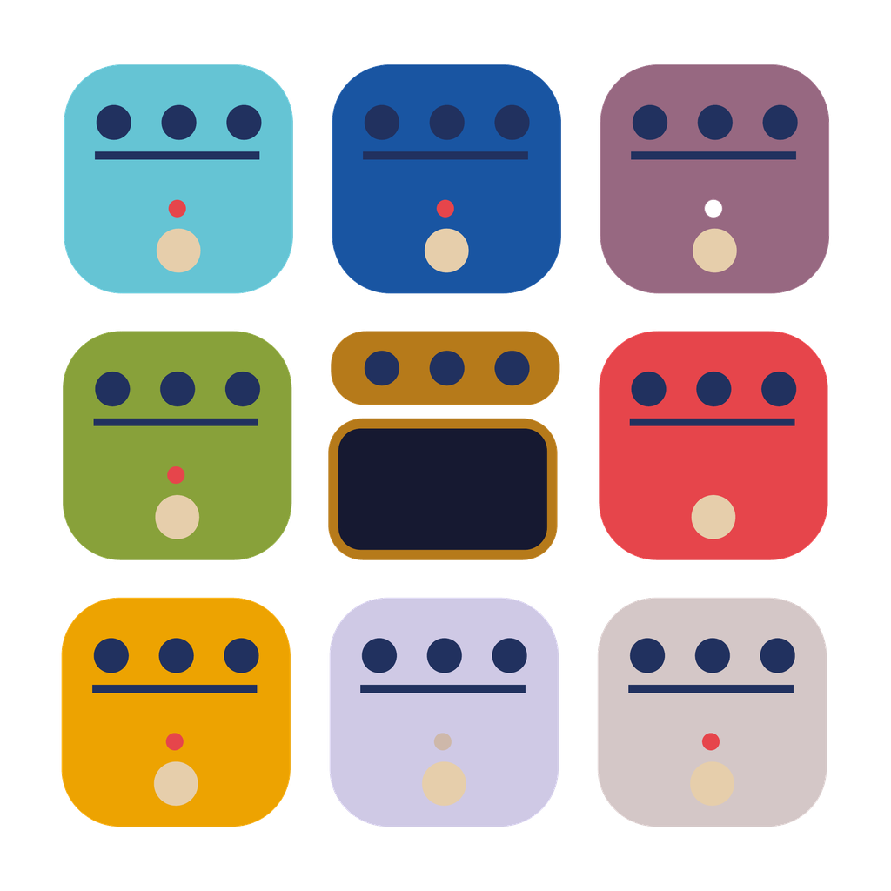

# StompForge



**Alpha 0.0.1** — ранняя тестовая версия гитарного аудиопроцессора от
Vlodzimej Garlic. Проверенная сборка доступна для Windows x64 в форматах VST3
и Standalone; в исходном коде также подготовлены iOS/iPadOS Standalone и AUv3.
Alpha предназначена
для проверки звука, совместимости оборудования и пользовательского интерфейса;
не используйте её как единственный процессор на концерте или при критичной
записи.

## Возможности

- Матрица педалборда от 1x1 до 4x3 с пустыми ячейками и drag-and-drop.
- До трёх основных регуляторов на карточке; остальные параметры находятся в
  окне `MORE`.
- Входной и выходной вертикальные фейдеры с индикаторами уровня.
- Сохранение параметров, геометрии матрицы и порядка модулей в проекте DAW.
- Mono и stereo с одинаковым числом входных и выходных каналов.
- Загрузка cabinet IR в форматах WAV/AIFF.
- Загрузка моделей Neural Amp Modeler `.nam` с автоматическим согласованием
  частоты дискретизации хоста.
- Защита от одновременного включения встроенного amp CABSIM и модуля IMPULSE.

## Модули

- **STARGATE** — noise gate.
- **DEIMOS-1** — circuit-inspired distortion с 4x oversampling.
- **FREQUENCY** — трёхполосный EQ.
- **CERES-2** — BBD-inspired chorus.
- **MARS-8** — британский ламповый amp с переключаемым 4x12 cabsim.
- **VULCAN-5** — Clean/Crunch/Lead amp с 6L6-inspired оконечным каскадом.
- **MODELER** — проигрыватель `.nam` на базе NeuralAmpModelerCore.
- **IMPULSE** — cabinet IR player с Low Cut, High Cut, Level и Mix.
- **VOID CHAMBER** — algorithmic reverb.
- **PULSAR** — digital delay.
- **LUNER** — проходной хроматический тюнер.

## Сценарии использования

- гитарная запись и re-amping в DAW через VST3;
- домашняя практика через Standalone и аудиоинтерфейс;
- построение цепочек distortion, modulation, amp, IR, delay и reverb;
- сравнение собственных amp-моделей с файлами `.nam`;
- быстрый тюнинг инструмента внутри общей цепочки;
- прототипирование пресетов и проверка разных порядков эффектов.

MODELER не содержит моделей усилителей. Пользователь самостоятельно выбирает
`.nam` и отвечает за право использовать и распространять конкретную модель.
Аналогичное правило относится к загружаемым impulse response.

## Установка Windows

Установщик размещает:

- VST3 в системный каталог Common Files/VST3;
- Standalone в Program Files/StompForge.

После установки перезапустите DAW или выполните повторное сканирование VST3.
В Standalone выберите аудиоинтерфейс, вход гитары, выход и безопасный размер
буфера. Начинайте с низкой громкости.

## Известные ограничения alpha

- Проверенная release-платформа — Windows 10/11 x64.
- iOS/iPadOS-конфигурация пока не прошла сборку, подпись и тестирование на
  физическом устройстве.
- Файлы `.nam` загружаются синхронно из UI; крупная модель может на короткое
  время задержать интерфейс.
- Выбранные `.nam` и IR импортируются в управляемое хранилище StompForge, но не
  встраиваются непосредственно в состояние проекта DAW.
- Пресеты и автоматизированная миграция отсутствующих внешних файлов пока не
  реализованы.
- Standalone ожидает гитару на аппаратном входе 1.

## Сборка

Требуются Git, CMake 3.22+ и Visual Studio 2022 с компонентом
`Desktop development with C++`.

```powershell
cmake -S . -B build -G "Visual Studio 17 2022" -A x64
cmake --build build --config Release
```

ASIO для Standalone включается только при явной передаче SDK:

```powershell
cmake -S . -B build -G "Visual Studio 17 2022" -A x64 `
  -DASIO_SDK_PATH="C:\SDKs\asiosdk"
cmake --build build --config Release
```

Без `ASIO_SDK_PATH` собирается Standalone с системными backend JUCE.

Артефакты:

- `build/StompForge_artefacts/Release/VST3/StompForge.vst3`
- `build/StompForge_artefacts/Release/Standalone/StompForge.exe`

Offline-проверка DSP:

```powershell
build\StompForgeDspSmokeTest.exe
```

### iOS/iPadOS

iOS-сборка выполняется на macOS генератором Xcode. Она создаёт Standalone
приложение и встроенное AUv3-расширение:

```bash
cmake -S . -B build-ios \
  -G Xcode \
  -DCMAKE_SYSTEM_NAME=iOS \
  -DCMAKE_OSX_DEPLOYMENT_TARGET=15.0

cmake --build build-ios --config Debug --target StompForge_Standalone \
  -- -sdk iphonesimulator
```

Для устройства необходимо передать Apple Development Team и зарегистрировать
bundle/App Group identifiers. Подробности и release gates находятся в
[Platforms/Apple/README.md](Platforms/Apple/README.md).

## Лицензирование

StompForge распространяется как свободное программное обеспечение по
[GNU Affero General Public License v3 или более поздней версии](LICENSE).
Исходный код можно использовать, изучать, изменять и распространять при
соблюдении условий AGPL, включая предоставление соответствующего исходного
кода получателям бинарных сборок.

NeuralAmpModelerCore и используемые NAM-компоненты распространяются по
permissive MIT; Eigen преимущественно использует MPL-2.0. Эти лицензии
допускают включение в StompForge при сохранении требуемых уведомлений.

JUCE 8 используется по открытому маршруту AGPLv3. Сборка alpha не включает
ASIO SDK; добавление ASIO требует отдельной проверки и соблюдения применимых
условий Steinberg.

Сторонние уведомления находятся в
[THIRD_PARTY_NOTICES.md](THIRD_PARTY_NOTICES.md). Это описание не является
юридической консультацией.
